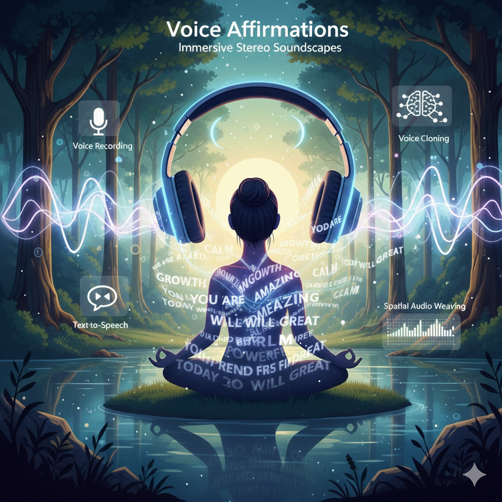

Your voice, your affirmations, woven into an immersive stereo soundscape.

## Features

- **Voice Recording** - Record voice samples with guided prompts
- **Voice Cloning** - Clone your voice using Chatterbox TTS (zero-shot, no training required)
- **Text-to-Speech** - Generate speech from any text in your cloned voice
- **Spatial Audio Weaving** - Layer clips with stereo positioning for an immersive experience

## Requirements

- macOS or Linux
- Python 3.11+
- ffmpeg (`brew install ffmpeg` on macOS, `apt install ffmpeg` on Linux)
- [uv](https://github.com/astral-sh/uv) (optional, for faster installation)

## Installation

```bash
./install.sh
```

This will:
1. Create two Python virtual environments
2. Install all dependencies
3. Download the Chatterbox voice cloning model (~2GB)

## Quick Start

```bash
./record.py                         # Record your voice (Ctrl+C to stop)
./prepare.py                        # Create voice reference
./generate_positive_audio_clips.py  # Generate affirmation clips
./weave.py                          # Weave into stereo soundscape
afplay spoken_messages_001.wav      # Listen (use headphones!)
```

### 1. Record samples of your voice

```bash
./record.py
```

Read the displayed paragraphs naturally. Press Enter to start, Ctrl+C to stop. Record 2-3 samples (30+ seconds total recommended).

### 2. Prepare voice reference

```bash
./prepare.py
```

Combines your voice samples into a single reference file for voice cloning.

### 3. Generate affirmations

```bash
./generate_positive_audio_clips.py
```

Reads messages from `positive_messages.txt` and generates audio files in `spoken_affirmations/`. If the file doesn't exist, you'll be prompted to create one from stock affirmations. By default, 6 random messages are sampled.

To change the sample count:

```bash
./generate_positive_audio_clips.py -n 10   # sample 10 messages
./generate_positive_audio_clips.py -n -1   # use all messages
```

Or provide custom messages directly (bypasses the file):

```bash
./generate_positive_audio_clips.py "You are amazing" "Today will be great"
```

Or pipe messages from stdin:

```bash
cat my_messages.txt | ./generate_positive_audio_clips.py
cat my_messages.txt | ./generate_positive_audio_clips.py -n 3   # sample 3
```

Edit `positive_messages.txt` to customize your affirmations. Lines starting with `#` are ignored.

### 4. Weave into soundscape

```bash
./weave.py
```

Creates `spoken_messages_001.wav` (incrementing on each run) with spatial stereo positioning. By default, all clips in `spoken_affirmations/` are used.

To create a shorter mix, specify a target duration in seconds:

```bash
./weave.py -t 60
```

This selects a subset of clips to produce roughly a 60-second output. The last clip plays to completion, so actual duration may slightly exceed the target.

### 5. Listen

```bash
# macOS
afplay spoken_messages_001.wav

# Linux
aplay spoken_messages_001.wav
```

🎧 **Use headphones for the full stereo effect!** 🎧

## Future Ideas

- **Prosodic-aware timing** - Detect natural pauses (breaths, sentence boundaries) in clips using `pydub.silence.detect_silence()` and align overlap start points to those pauses. This would prevent the jarring effect of a new voice starting mid-word.

- **Adaptive complexity ramp** - Start with simpler arrangements (more spacing, less overlap) and gradually increase complexity as the session progresses. This helps the brain acclimate to multi-stream processing.

- **Loudness normalization** - Normalize all clips to consistent perceived loudness (LUFS) to prevent jarring volume differences between clips.

- **Content-aware tempo** - Automatically adjust tempo based on message length: slower for longer/complex messages, faster for short punchy affirmations.

- **Binaural beats layer** - Add subtle low-frequency undertones (e.g., 10Hz alpha waves) to enhance relaxation during affirmation absorption.

## Acknowledgments

This project uses [Chatterbox](https://github.com/resemble-ai/chatterbox) for text-to-speech cloning.

## License

MIT
